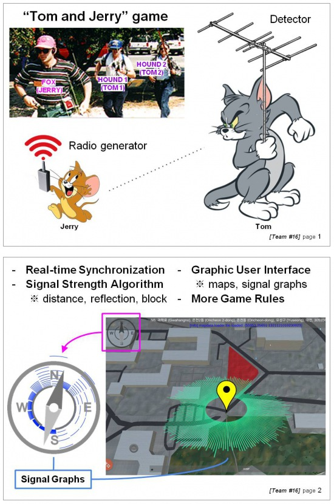

# Tom-and-Jerry Simulation ([Transmitter Hunting](https://en.wikipedia.org/wiki/Transmitter_hunting))
Implementation of virtual gears required for the sport called the Foxhunt game where ‘hounds’ hunt down ‘a fox’ by observing the virtual signal calculated from a signal simulation using real GPS and Map data using mobile smartphones and multi-core processing server. We renamed to Tom-and-Jerry game for intuitive understanding of this game.

## Presentation
* **MOSP**: click to play the video on YouTube.

## Introduction

## Documents
* [2017/03/20] - [Idea pitching]([2017.3.20]_idea_pitching.pdf)
* [2017/04/05] - [Project document]([2017.4.05]_project_document.pdf)
* [2017/04/10] - [MOSP (Interim Presentation)]([2017.4.10]_middle_of_semester_presentation.pdf)

## Installation
### OSM crawling

1. Install [BeautifulSoup](https://www.crummy.com/software/BeautifulSoup/bs4/doc/#installing-beautiful-soup).

        $ pip install beautifulsoup4

2. Export [OpenStreetMap](http://www.openstreetmap.org/export) data that will be used.
3. Run our [Python Code](OSMcrawling/MapData_Crawling.py).
4. Then you can get the results: (e.g.)

		i	949	117	4
		# nodes
		n	36.3673981	127.3637097
		n	36.3674462	127.3638063
		n	36.3677069	127.3643303
		n	36.3675444	127.364455
		n	36.3674521	127.3642694
		n	36.3674026	127.3641699
		n	36.3672357	127.3638344
		b E2-2	0	1	2	3	4	5	6	0
		
first line: i, #of nodes, #of buildings, #of forests
		
### Signal Simulation
* Reflection Simulation on: # of signal:360

* Signal blocking by forests on KAIST MAP

### [Open MPI](https://www.open-mpi.org/)
Our first proposal included MPI technology, but now we only consider to use only GPU because it's enough.

### OpenCL-[NVIDIA CUDA](https://developer.nvidia.com/cuda-downloads)
OpenCL should be installed based on your graphics processing unit (GPU). (e.g. AMD, NVIDIA) We are using CUDA from NVIDIA in this project.

### [Unity 3D](https://unity3d.com/)
In this project, we are using [reinterpret](https://github.com/reinterpretcat/utymap/)'s demo code. Make sure to install correctly. You can also run this demo code on Android.

